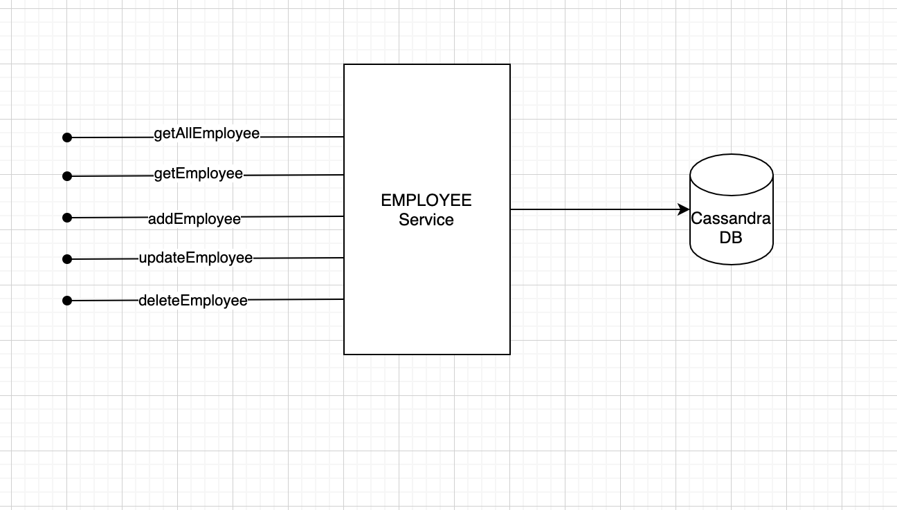

> Written with [StackEdit](https://stackedit.io/).
# spring-webflux-poc

This repo contains a SpringBoot Microservice which is flavoured with spring reactive based CRUD APIs

# Need of PoC
Spring reactive is a new paradigm being used to develop REST Apis to address Non-Blocking concern of the Workload. Spring has released the component **spring-boot-starter-webflux**. I took good amount of time to explore the webflux while I was working for a customer and found web-flux is a very component to build non-blocking rest APIs. Since webflux based REST apis development is new in market and we have got a very few documentation in the internet. This PoC is a kind of learning for me which I want to showcase to the developers who are in need of. 

# Technologies Used

 - Java
 - SpringBoot
	 - Spring Web Flux
 - Apache Cassandra

# Diagram

# Pre-Requisite
To be able to explore and run this service, you should have the below as a pre-requisites.

 - java
 - Apache Cassandra
 
	 **Cassandra Installation Steps**
 
 Well, I've used MAC to develop this PoC. Installation of Cassandra is fairly simple. Its just a single line command to install the cassandra. I dont want to get into more on the installation of Cassandra as we get enough documentation on it. 

    brew install cassandra

Some commands that helps you related to cassandra are below. I've set the below commands as alias on my bashprofile. 

 - To start the cassandra instance post installation.

    cassandra -f
    
 - Type **cqlsh** to enter cqlsh shell. 
 
 - On cqlsh shell
	 - Create Keyspace Command:
	 
		 `create keyspace <keyspace_name> WITH replication = {'class': 'SimpleStrategy', 'replication_factor':1};`
	 - List Keyspace command
	 
		 `desc keyspaces;`
	 - Use a specific keyspace
	 
	     `use <keyspace_name>` ;
	 - Create table command
	 
		 `create table employee (EmployeeId int primary key, first_name varchar, last_name varchar, department_name varchar);`
    	
	 - Help command
	 
		 `Type HELP on cqlsh shell for any help with the commands available.`

# Employee MicroService

Sorry!! As always, I've chosen Employee as a Business Entity to develop the Microservice as it is a very easy use-case to showcase the CRUD capabilities of a service using **Employee** Business Entity. 

Microservice interacts with Cassandra database which acts a datastore for Employee Microservice. Below are the configurable parameters to be mentioned in **application.properties.** 

    spring.data.cassandra.keyspace-name=<keyspace_name>
    spring.data.cassandra.port=9042
    spring.data.cassandra.local-datacenter=datacenter1

This Service exposes the below endpoints and they are very much self explanatory.

| API|Description |  Method| URI | HttpStatus Code|
|--|--|--|--|--|
| getAllEmployees|Endpoint to fetch all the employee details| GET  |/api/v1/webfluxservice/{employeeId}/employeeId/employees |200|
|getEmployee|Endpoint to fetch a specific employee detail |GET|/api/v1/webfluxservice/{employeeId}/employeeId/employee|200|
|deleteEmployee|Endpoint to delete a specific employee detail|DELETE|/api/v1/webfluxservice/{employeeId}/employeeId|200|
|createEmployee|Endpoint to create a new Employee Resource|POST|/api/v1/webfluxservice/employee|201|
|updateEmployee|Endpoint to update existing employee detail|PUT|/api/v1/webfluxservice/employee|200|
